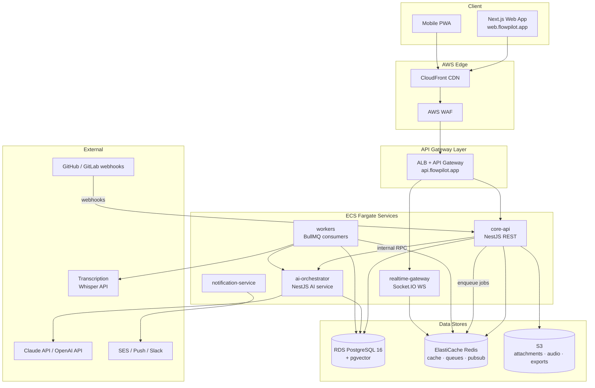

# FlowPilot — Product & System Architecture

> FlowPilot is an AI-first project management platform: an AI Project Manager copilot that plans projects, creates tasks, manages sprints, predicts delays, and generates reports — 10x simpler than Jira.

- **Frontend:** Next.js 14 (App Router), React, TypeScript, Tailwind, shadcn/ui, Framer Motion
- **Backend:** NestJS, PostgreSQL 16 (+ pgvector), Redis 7, BullMQ
- **AI:** Claude (planning, long-context) + OpenAI GPT (classification, embeddings), RAG over pgvector
- **Cloud:** AWS (ECS Fargate, RDS, ElastiCache, S3, CloudFront)

---

## 1. High-Level Architecture



## 2. Service Responsibilities

| Service | Runtime | Responsibility |
|---|---|---|
| **core-api** | NestJS, HTTP | REST API (`/v1/*`): auth, orgs, projects, work items, sprints, analytics, billing. Owns all writes to Postgres. Publishes domain events to Redis Streams. |
| **ai-orchestrator** | NestJS, HTTP + queue | LLM routing, tool-calling loop, RAG retrieval, prompt assembly, streaming token relay, AI usage metering. Stateless; never writes domain data directly — calls core-api's internal API with the tenant context. |
| **realtime-gateway** | Socket.IO on Fargate | WebSocket fan-out: board updates, presence, AI token streams, notifications. Subscribes to Redis pub/sub channels `tenant:{org_id}:*`. Horizontally scaled with the Redis adapter. |
| **workers** | BullMQ consumers | Queues: `embeddings`, `transcription`, `ai-insights`, `reports`, `automations`, `webhooks-out`, `emails`. Retries with exponential backoff, DLQ per queue (`<queue>:dead`). |
| **notification-service** | BullMQ consumer + SES | Digest batching, channel routing (in-app, email, Slack, push), per-user notification preferences. |

**Why split ai-orchestrator from core-api:** independent scaling (LLM calls are long-lived, IO-bound), separate cost/rate-limit blast radius, independent deploys for prompt changes, and a single choke point for AI safety and metering (see `05-ai-architecture.md`).

## 3. Data Stores

| Store | Used for |
|---|---|
| **PostgreSQL (RDS)** | System of record. Pooled multi-tenant with RLS (`06-multi-tenancy.md`). pgvector extension hosts the `embeddings` table — one DB, no separate vector infra at MVP scale. |
| **Redis (ElastiCache)** | (1) BullMQ job queues, (2) cache: session lookups, plan limits, feature flags (TTL 60s), (3) pub/sub for realtime fan-out, (4) rate-limit counters (sliding window), (5) AI token-budget counters per org/day. |
| **S3** | `flowpilot-attachments` (user uploads, presigned URLs), `flowpilot-media` (meeting audio, retained 90 days), `flowpilot-exports` (report PDFs/CSVs, lifecycle-expired after 30 days). |

Full schema in `03-database-schema.md`.

## 4. AWS Deployment Topology

```
Region: us-east-1 (primary) · 3 AZs
├── VPC 10.0.0.0/16
│   ├── Public subnets ....... ALB, NAT gateways
│   ├── Private subnets ...... ECS Fargate tasks (all 5 services)
│   └── Isolated subnets ..... RDS, ElastiCache (no internet route)
├── CloudFront
│   ├── web.flowpilot.app → Next.js (SSR on Fargate, static from S3)
│   └── cdn.flowpilot.app → S3 attachments (signed cookies)
├── ECS Fargate (one service per component, blue/green via CodeDeploy)
│   ├── core-api ............. 3–20 tasks, 1 vCPU / 2 GB
│   ├── ai-orchestrator ...... 2–15 tasks, 1 vCPU / 2 GB
│   ├── realtime-gateway ..... 2–10 tasks, 0.5 vCPU / 1 GB
│   ├── workers .............. 2–25 tasks, 1 vCPU / 2 GB
│   └── notification-service . 1–4 tasks, 0.25 vCPU / 0.5 GB
├── RDS PostgreSQL 16 ........ db.r6g.xlarge, Multi-AZ, 2 read replicas
│   └── RDS Proxy in front of core-api (connection pooling)
├── ElastiCache Redis 7 ...... cluster mode disabled, 1 primary + 2 replicas
├── S3 + KMS ................. SSE-KMS on all buckets, per-env keys
├── Secrets Manager .......... DB creds, LLM API keys (rotated 90d)
└── Route53 + ACM ............ DNS, TLS certs
```

Environments: `dev`, `staging`, `prod` — separate AWS accounts (Organizations), IaC via Terraform, promoted through GitHub Actions → ECR → CodeDeploy.

## 5. Scaling Strategy

| Layer | Trigger | Approach |
|---|---|---|
| core-api | ALB RequestCountPerTarget > 800 or CPU > 65% | Horizontal, stateless; RDS Proxy caps DB connections |
| ai-orchestrator | Active LLM streams per task > 40 (custom CloudWatch metric) | Horizontal; per-provider concurrency limiter with queued overflow |
| realtime-gateway | Connections per task > 8k | Horizontal; sticky sessions at ALB, Redis adapter for cross-node fan-out |
| workers | Queue depth per queue (e.g. `embeddings` > 500 jobs) | Horizontal per-queue via separate task sets |
| Postgres | Read CPU > 60% | Route analytics + RAG retrieval reads to replicas; partition `activity_log` and `audit_logs` monthly; pgvector HNSW indexes rebuilt off-peak |
| Redis | Memory > 70% | Scale node class; queues and cache split into two clusters at >5k orgs |

Load targets at GA: 5k concurrent users, 300 rps API, 500 concurrent AI streams, p95 API latency < 250 ms (non-AI endpoints).

## 6. Observability

- **Tracing:** OpenTelemetry SDK in every NestJS service → ADOT collector sidecar → AWS X-Ray + Grafana Tempo. Trace context propagated through BullMQ job payloads (`traceparent` field) and into LLM call spans (model, tokens, cost as span attributes).
- **Metrics:** Prometheus via `/metrics` on each service, scraped by Amazon Managed Prometheus; Grafana dashboards per service. Key SLIs: API p95/p99, WS delivery lag, queue age (oldest job), AI time-to-first-token, AI cost per org per day.
- **Logs:** Structured JSON (pino) → CloudWatch → OpenSearch. Every log line carries `org_id`, `user_id`, `trace_id`, `request_id`. LLM prompts/completions logged to a separate restricted log group (30-day retention, PII-scrubbed).
- **Alerting:** PagerDuty. SLOs: 99.9% API availability, 99.5% AI copilot availability (degrades gracefully to non-AI features), queue age < 2 min for `automations`, < 10 min for `embeddings`.
- **Error tracking:** Sentry (frontend + backend), release-tagged.

## 7. Security Baseline

- All traffic TLS 1.2+; internal service calls signed with short-lived service JWTs (issuer: core-api).
- RLS-enforced tenant isolation at the database layer (`06-multi-tenancy.md`) — application bugs cannot leak cross-tenant rows.
- Secrets in AWS Secrets Manager; no secrets in env files or images.
- WAF managed rules + rate limiting at edge; per-tenant rate limits in core-api (`04-api-structure.md` §7).
- Audit trail: every privileged action written to `audit_logs` (append-only, see schema).

## 8. Failure Modes & Degradation

| Failure | Behavior |
|---|---|
| LLM provider down | ai-orchestrator fails over Claude ↔ GPT per routing table; if both down, copilot UI shows "AI unavailable", core PM features unaffected |
| Redis down | API stays up (cache-miss to PG); queues pause; realtime clients fall back to 30s HTTP polling |
| PG primary failover | RDS Multi-AZ promotes standby (< 60s); core-api retries idempotent writes via request idempotency keys |
| Worker crash mid-job | BullMQ redelivery (jobs are idempotent, keyed by `job_key`) |
