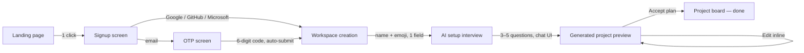
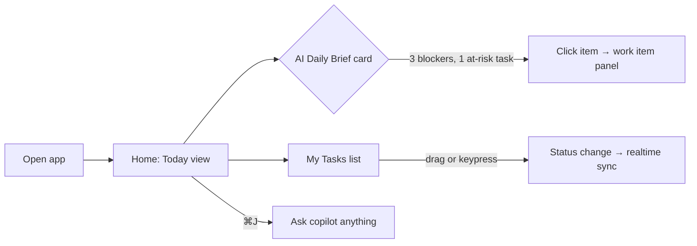
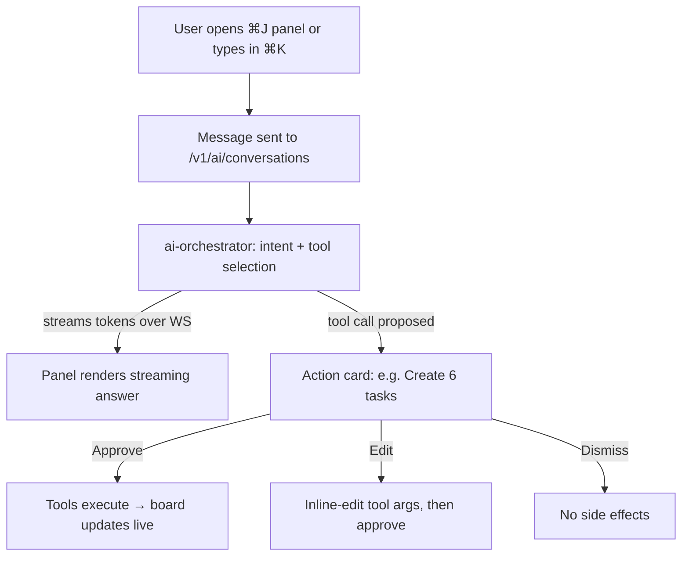
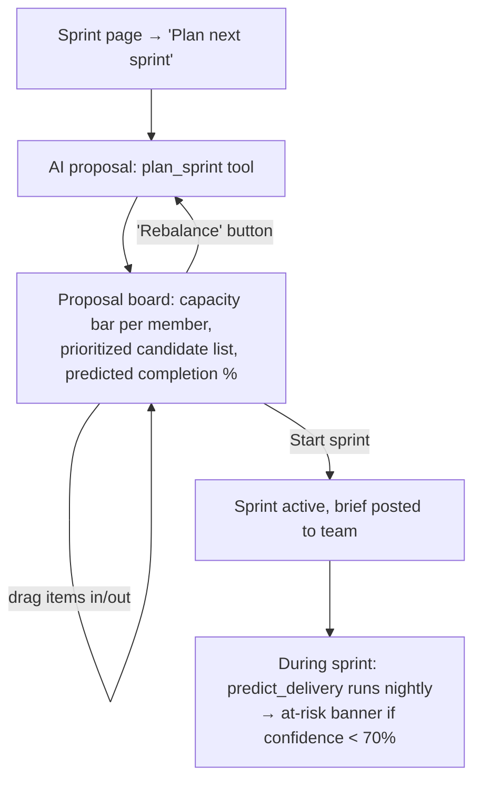
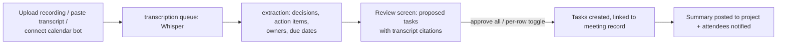
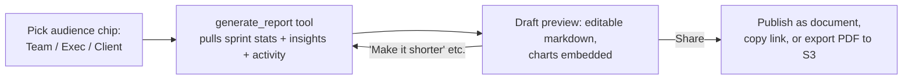

# FlowPilot — UX Flows

Design intent: **minimal clicks, AI does the heavy lifting.** Every flow below is measured in clicks/keystrokes; if a competitor needs a form, we need a sentence. Global affordances on every screen:

- `⌘K` — command palette (navigate, create, run any AI tool)
- `⌘J` — toggle **Copilot panel** (right-side dock, persistent conversation per project)
- `C` — quick-create work item from anywhere

---

## 1. Onboarding: Signup → OTP → Workspace → AI Project Interview

Target: **signed up to a fully planned project in under 4 minutes, ≤ 9 clicks.**

**Screen: Signup** — Single card, logo, three SSO buttons (Google, GitHub, Microsoft) + email field. No password field ever (passwordless via OTP or SSO). Legal links in footer. Motion: card fades up 200ms.

**Screen: OTP** — Six input cells, auto-advance, auto-submit on 6th digit, paste-aware. Resend link with 30s cooldown. Wrong code shakes the cells (150ms spring).

**Screen: Workspace creation** — One input ("Name your workspace") pre-filled from email domain (`vasundhara.com` → "Vasundhara"), emoji picker, optional invite field ("paste emails, comma-separated"). Continue is a single click. Creates `organization` + default `workspace` (see `03-database-schema.md`).

**Screen: AI setup interview** — Full-screen chat with the copilot. Instead of a 12-field project form, the AI asks 3–5 adaptive questions:

1. "What are you building?" (free text)
2. "Who's on the team?" (chips from invited members, or free text roles)
3. "Any deadline or milestone I should plan around?"
4. Optional follow-ups only when answers are ambiguous.

Skippable at any point ("Skip — start empty"). Answers stream into a live-updating plan preview in the right pane.

**Screen: Generated project preview** — The AI's `create_project` tool output rendered as an editable tree: project → epics → stories → first-sprint tasks, each with estimates and suggested assignees. User can rename/delete inline, then one click **"Create project"** materializes everything. Confetti-free; a subtle checkmark morph (250ms) and redirect to the board.

## 2. Daily-Use Flow ("Morning loop")

**Screen: Home / Today** — Left nav (workspaces, projects, pinned views). Center: **AI Daily Brief** (generated 7am local by the `reports` worker): what changed overnight, blockers, at-risk items from `ai_insights`, suggested focus. Below: My Tasks grouped by due state. Every list row supports keyboard: `E` assign, `S` status, `D` due date, `Enter` open. Zero-click information radiator: the brief is already there when you arrive.

**Screen: Work item panel** — Slide-over (not a page navigation), 320ms ease-out. Title, status pill, assignee avatar, sprint, estimate, description, subtasks, comments with `@mentions`, activity tab, linked PRs (auto-updated — see `05-ai-architecture.md` §9). Copilot inline actions: "Summarize thread", "Draft acceptance criteria", "Split into subtasks".

## 3. AI Copilot Interaction Flow

**Rules:** the copilot **never mutates data without an approval card** (except when the user has enabled auto-approve per tool in settings). Action cards show a human-readable diff ("+ 6 tasks in Sprint 12, ~3 reassignments"). Every executed action lands in `activity_log` attributed to `actor_type = 'ai'` with the approving user. Undo is one click for 30 seconds (soft-revert).

## 4. Project Creation via AI (post-onboarding)

Entry points: `⌘K → "New project"`, or just telling the copilot "spin up a project for the Q3 mobile redesign".

1. Copilot asks the same adaptive interview (§1) inside the panel — 2–4 questions because it already knows the team, velocity, and org context via RAG.
2. Calls `create_project` then `create_tasks` (tool registry in `05-ai-architecture.md` §2) — preview tree appears.
3. One click **Create**. Total: ~2 clicks + typed answers.

Fallback: "Blank project" link for people who hate magic — a one-field modal.

## 5. Sprint Planning Flow

Target: plan a sprint in **under 5 minutes, ≤ 6 clicks** (vs ~40 in Jira).

**Screen: Sprint proposal** — Two columns: *Proposed sprint* (with per-member capacity bars, red when > 85%) and *Backlog candidates* ranked by the AI (priority × dependency order × staleness). Header shows **predicted completion probability** (from the delivery prediction model, `05-ai-architecture.md` §5) recalculated live as items are dragged. "Why this plan?" popover shows AI reasoning. Buttons: **Rebalance**, **Start sprint**.

## 6. Meeting-to-Tasks Flow

**Screen: Meeting review** — Left: transcript with speaker labels, highlight spans that produced each item. Right: proposed task rows (title, owner guess, due-date guess, source quote). Each row: ✓ accept / ✏ edit / ✕ reject. **"Accept all"** is the primary button — the AI is tuned for precision so accept-all is the common path (target ≥ 80% acceptance rate without edits). Rejections are logged as eval signal.

## 7. Voice-to-Tickets Flow

Entry: mic button in quick-create (`C`) or mobile PWA home.

1. Hold-to-talk (or tap-to-toggle). Waveform animates while recording.
2. Audio → `/v1/ai/voice-tickets` → Whisper → extraction (same pipeline as meetings but single-utterance mode).
3. "Fix the login redirect bug on Safari, high priority, give it to Priya" → one preview card: **Bug · Fix login redirect on Safari · P1 · @Priya**.
4. Single tap **Create**. Ambiguity (two Priyas) → inline chip picker, still one screen.

Total interaction: hold, speak, tap. **2 touches.**

## 8. Report Generation Flow

Entry: project header "Report" button, `⌘K → "Generate report"`, or a scheduled automation (weekly stakeholder update).

**Screen: Report preview** — Draft opens in the document editor with AI-generated sections (progress, risks from `ai_insights`, next-sprint outlook). Audience chip changes tone and detail level; regeneration keeps manual edits (diff-merge, edited blocks are locked). One click to publish or schedule as a recurring automation. Clicks from intent to shared report: **3**.

## 9. Notifications & Inbox Flow

- Bell icon → **Inbox** slide-over: mentions, assignments, AI insights, digests — grouped by project, unread-first (backed by `notifications` table, live via `notification.created` WS event).
- Row click deep-links to the entity with the relevant comment/insight highlighted; `E` archives, `U` marks unread; "Archive all" per group.
- Preferences (per user, stored in `users.preferences`): per-kind channel matrix (in-app / email / Slack / push) and a daily digest hour. Defaults are quiet: only mentions + assignments email immediately, everything else batches into the digest.
- At-risk insights (`severity: critical`) are the only notifications allowed to push during quiet hours — and orgs can disable even that.

## 10. Cross-Flow Principles

- **Optimistic UI everywhere:** mutations render instantly, reconcile via WebSocket events (`04-api-structure.md` §9); conflicts resolve last-write-wins with a toast.
- **AI is previewable, reversible, attributable:** approval cards, 30s undo, `actor_type='ai'` in activity.
- **No dead ends:** every empty state has one primary CTA and one "ask the copilot" prompt.
- **Keyboard parity:** every click path in this doc has a keyboard path; power-user latency budget: any common action reachable in ≤ 3 keystrokes.
- **Loading discipline:** skeletons only above 300ms; AI streams always show tokens within 1.5s (time-to-first-token SLO) or degrade to a progress note.
