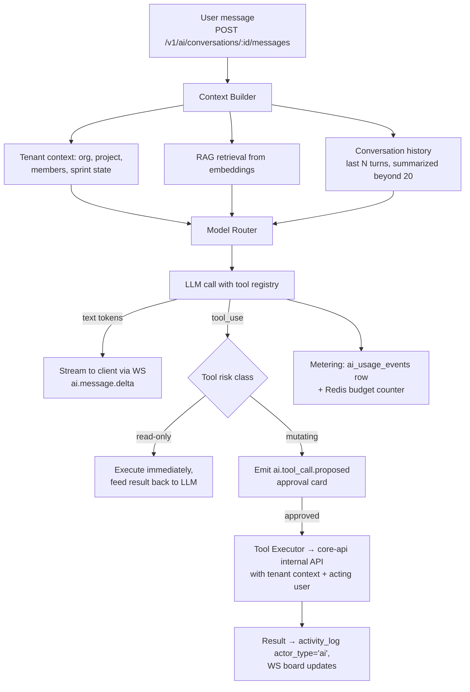

# FlowPilot — AI Copilot Architecture

The **ai-orchestrator** service (see `01-product-architecture.md` §2) owns every LLM interaction. Core principle: *the LLM proposes, deterministic code disposes.* All side effects go through typed tools, all tool executions require user approval (or explicit per-tool auto-approve), and everything is metered per tenant.

## 1. Orchestrator Pattern

The agent loop is bounded: max 8 tool iterations per message, max 3 mutating proposals per message. The orchestrator is stateless — conversation state lives in `ai_conversations` / `ai_messages` (schema in `03-database-schema.md` §7).

### Prompt Assembly & Context Budget

The context builder assembles a fixed-order prompt so prompt caching hits on the stable prefix:

| Block | Order | Budget (tokens) | Cacheable |
|---|---|---|---|
| System prompt (persona, rules, safety) | 1 | ~1.2k | yes |
| Tool definitions (registry, plan-filtered) | 2 | ~2.5k | yes |
| Org context (members, projects, sprint cadence) | 3 | ~1k, refreshed on change | yes (per org) |
| Project snapshot (`get_project_state` digest) | 4 | ≤ 2k | no |
| RAG chunks (top-8, fenced, cited) | 5 | ≤ 3k | no |
| Conversation history (rolling summary + last 10 turns) | 6 | ≤ 4k | no |
| User message | 7 | unbounded (input-capped at 8k) | no |

Tools exposed to the model are filtered by plan (`plans.limits`) and the acting user's role — a `guest` never sees mutating tools at all, so the model cannot even propose them.

## 2. Tool / Function Registry

Tools are declared once in TypeScript with Zod schemas; the same definitions generate the LLM tool spec, runtime validation, and approval-card rendering. Risk class drives the approval flow.

| Tool | Risk | Description |
|---|---|---|
| `search_knowledge` | read | RAG search over work items, docs, comments, transcripts |
| `get_project_state` | read | Structured snapshot: sprint, statuses, capacity, velocity |
| `predict_delivery` | read | Run the delivery prediction model for a sprint/project |
| `create_project` | mutate | Project + epic/story tree from interview answers |
| `create_tasks` | mutate | Bulk work-item creation (`POST /work-items/bulk`, `source:'ai'`) |
| `update_work_items` | mutate | Bulk field changes (status, assignee, sprint, estimate) |
| `plan_sprint` | mutate | Sprint composition proposal: items, assignments, capacity math |
| `generate_report` | read* | Status/standup/stakeholder report → document or PDF export |
| `summarize_meeting` | read | Summary + decisions from a transcript |
| `extract_action_items` | mutate | Transcript → proposed tasks (meeting pipeline) |
| `create_document` | mutate | Write a doc (PRD draft, retro notes) |
| `detect_risks` | read | On-demand risk scan → `ai_insights` rows |
| `notify` | mutate | Send a notification/Slack message on user's behalf |

*`generate_report` is auto-approved by default (no domain mutations; writes only an export artifact).

Execution rules: tool args are validated against Zod before display; the executor calls core-api with a service JWT carrying `org_id` + `acting_user_id`, so RLS and plan limits apply to AI exactly as to humans.

## 3. RAG Pipeline

**Ingestion** — Every create/update of `work_items`, `comments`, `documents`, `meeting_transcripts` emits a domain event; the `embeddings` BullMQ queue upserts chunks. Deletes tombstone the rows.

**Chunking** — Work items: title + description as one chunk (they're short). Documents: heading-aware markdown splitter, 400–700 tokens, 80-token overlap. Transcripts: speaker-turn windows of ~500 tokens. Each chunk stored with `source_type`, `source_id`, `chunk_index`.

**Embeddings** — OpenAI `text-embedding-3-small` (1536-dim) → `embeddings` table, HNSW cosine index (`03-database-schema.md` §7). Batch size 64, retried with backoff; nightly reconciliation job re-embeds drifted rows.

**Retrieval** — Hybrid: top-40 by vector cosine + top-40 trigram/keyword, reciprocal-rank fusion, then a cheap GPT rerank to top-8. Filters always include `org_id` (RLS enforces it regardless) and optionally `project_id`. Retrieved chunks are injected with source citations (`FLOW-214`, doc titles) so the copilot can link its answers.

## 4. Model Routing

| Task | Model | Why |
|---|---|---|
| Planning, sprint composition, project interviews, report writing | Claude Sonnet | Best long-context reasoning + tool use |
| Deep multi-project analysis (enterprise "portfolio review") | Claude Opus | Quality over cost, rare invocations |
| Intent classification, rerank, title generation, extraction validation | GPT-4.1-mini class | 10–30x cheaper, latency-sensitive |
| Transcription | Whisper API | Meetings/voice |
| Embeddings | text-embedding-3-small | Cost + quality at 1536 dims |

Routing table lives in config (per-env, hot-reloadable). Failover: on provider 5xx/timeout ×2, retry the equivalent tier on the other provider; degrade Opus→Sonnet→GPT-4.1 before failing. Every response records `model`, tokens, and cost on `ai_messages`.

## 5. Delivery Prediction Model

Runs nightly per active sprint (worker queue `ai-insights`) and on-demand via `predict_delivery` / `GET /analytics/forecast`.

**Features** (computed from Postgres, no LLM): remaining points vs elapsed sprint %, team's trailing 6-sprint velocity mean/stddev, scope added after sprint start (%), per-assignee load vs historical throughput, item staleness (days in `in_progress` > p75 of historical cycle time), dependency depth (`parent_id` chains with incomplete parents), review queue depth, PR linkage lag (items `in_progress` with no linked branch after 2 days).

**v1 heuristic model:** Monte Carlo over historical cycle-time distributions per (type, estimate) bucket — 2,000 simulated sprint completions → completion probability + expected finish date + top-3 contributing factors. Explainable by construction; factors render in the "Why?" popover (`02-ux-flows.md` §5). **v2:** gradient-boosted model trained on cross-tenant anonymized aggregates (opt-out honored), same feature vector, shadow-scored against v1 for 4 weeks before promotion. Output → `ai_insights` rows (`kind:'delay_prediction'`, `detail.confidence`).

## 6. Risk Detection Engine

Rule + LLM hybrid, nightly and event-triggered:

- **Deterministic rules:** blocked > 3 days; assignee overloaded (> 130% of trailing throughput); sprint scope grew > 20%; item with due date < 3 days and status `backlog/todo`; critical-path parent incomplete while children done.
- **LLM pass (GPT-mini):** scans recent comments/standup notes for soft signals ("waiting on legal", "not sure this is possible") → candidate risks with quoted evidence.
- Everything lands in `ai_insights` (`kind:'risk'`, severity mapping documented in the rules), deduplicated by `(entity_id, kind)` with 7-day cooldown, surfaced in the Daily Brief and `ai.insight.created` WS event.

## 7. Meeting-to-Tasks Pipeline

`POST /v1/ai/meetings` → S3 audio upload → `transcription` queue:

1. **Transcribe:** Whisper w/ diarization → `meeting_transcripts.segments`.
2. **Summarize:** Claude → summary, decisions, open questions.
3. **Extract:** Claude with `extract_action_items` schema → candidates `{title, owner_guess, due_guess, source_span}`; owner guesses resolved against org members by fuzzy name match, unresolved → unassigned.
4. **Validate:** GPT-mini pass rejects non-actionable candidates (tuned for precision — "accept all" must be safe, target ≥ 80% unedited acceptance).
5. **Review:** status `review`; user approves per-row or all (`02-ux-flows.md` §6) → `POST /ai/meetings/:id/apply` creates work items with `source:'meeting'` and a link back to the meeting + transcript span.

Rejections/edits are logged as labeled eval data (§11).

## 8. Voice-to-Tickets

Same extraction stack in single-utterance mode: audio (≤ 60s) → Whisper → one Claude call with `create_tasks` schema constrained to a single item → preview card → one-tap create (`source:'voice'`). Latency budget: < 4s p95 from release-of-mic to preview. Ambiguous entities (assignee, project) return `candidates[]` rendered as chips — never guessed silently when confidence < 0.8.

## 9. Auto Status Updates from Git/PR Activity

Inbound `POST /webhooks/github` (and GitLab), signature-verified:

- Branch `feat/FLOW-214-login-redirect` or PR title/body containing `FLOW-214` → links PR to work item.
- PR opened → item `in_progress` (if `todo/backlog`); PR marked ready-for-review → `in_review`; PR merged → `done` if the item's remaining subtasks are done, else comment "PR merged, 2 subtasks open".
- All transitions are automations under the hood (`automations` table, system-owned) — orgs can disable or remap them per project. Transitions appear in `activity_log` as `actor_type:'automation'` and emit normal WS events.

## 10. Safety, Prompt Injection & Guardrails

- **Untrusted-content fencing:** all RAG chunks, transcripts, webhook text, and user-generated content are wrapped in delimited blocks with the instruction that they are data, never instructions; system prompt asserts tool calls may only originate from the *user's* request.
- **Injection heuristics:** pre-retrieval scan of chunks for instruction-like patterns ("ignore previous", "call the tool") → flagged chunks are still retrievable but stripped-quoted.
- **Capability firewall:** tools are the only side-effect channel; the executor re-checks RLS/tenant/role/plan on every call — a jailbroken model still cannot exceed the acting user's permissions.
- **Mutating actions require approval cards** (`02-ux-flows.md` §3); `notify` is capped at 10 recipients per call.
- **Egress control:** ai-orchestrator has no network path except LLM provider endpoints (VPC egress allowlist).
- **PII & retention:** prompts/completions in restricted log group, 30-day retention; enterprise plan supports zero-retention vendor agreements and (roadmap) dedicated model endpoints.
- **Output checks:** links in AI output must resolve to same-org entities; markdown sanitized.

## 11. Cost Controls & Evaluation

**Cost:**
- Per-org daily token budget in Redis (`ai_budget:{org_id}:{yyyymmdd}`), sourced from `plans.limits.ai_tokens_month / 30`; soft warn at 80%, hard stop with upgrade CTA at 100% (free/pro), alerting only for enterprise.
- Routing defaults to the cheapest adequate model (§4); prompt caching for stable system prompts + org context blocks; history summarization beyond 20 turns.
- Nightly job aggregates `ai_usage_events` → per-org margin dashboard; alert when any org's AI cost > 40% of its MRR.

**Evaluation:**
- Golden-set evals in CI for each tool prompt (≥ 50 cases each: project interview → plan quality rubric, meeting extraction P/R against hand-labeled transcripts, injection red-team suite must be 100% pass).
- Online metrics: tool-call approval rate, edit-before-approve rate, meeting accept-all rate, insight dismissal rate, thumbs up/down on messages — all logged and reviewed weekly; regressions gate prompt/model changes (prompts are versioned, canary-rolled to 5% of orgs).
- Prediction calibration: weekly reliability check of `delay_prediction` confidences against actual sprint outcomes (target: calibration error < 10%, tracked per plan tier).
- Every rejected/edited AI proposal is stored with its full context as a labeled example; the eval sets grow from production, not synthetic data.

**AI service SLOs:** time-to-first-token < 1.5s p95 (copilot chat), voice-ticket preview < 4s p95, meeting pipeline end-to-end < 10 min for a 60-min recording, nightly insight jobs complete before 7am local Daily Brief generation (`02-ux-flows.md` §2).
